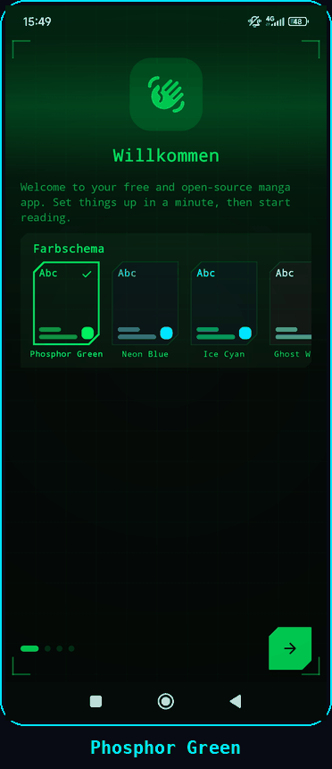

<p align="center">
  
</p>

<h1 align="center">CipherDrop</h1>

<p align="center">
  A lightweight, modern comic and novel reader for Android with a beautiful Material 3 Expressive design. Supports Mihon and LNReader extensions.
</p>

<p align="center">
  <a href="LICENSE"></a>
  <a href="https://developer.android.com/"></a>
  <a href="https://kotlinlang.org/"></a>
  <a href="https://developer.android.com/compose"></a>
</p>

---

## About

CipherDrop is a free and open-source comic and novel reader for Android, built to feel quick, clean, and comfortable to use with a lot of features

⭐Please give the repo a star if you like the project. It helps more people find it.🌟

## About this fork

This is an unofficial community fork of [CipherDrop](https://github.com/HuzaifaKhalid1311/CipherDrop), which is itself built on Kotatsu, Mihon and LNReader. It is not affiliated with the original project, and it has no website or Discord server of its own. Release APKs are published on this repository's Releases page.

### What is different in this fork

- **Cyber Terminal theme.** The app has one dark "cyber hacker" look, ported from SQL Reader:
  - monospace typography and cut-corner shapes
  - an animated background with a glow, a grid, a scan beam and corner brackets
  - seven accent colours (green, blue, cyan, white, amber, red, purple), plus a switch for the animated background in Appearance settings
  - the Light, System and AMOLED options are removed
- **The app stays inside the safe area.** Every screen now sits between the status bar and the navigation bar instead of being drawn behind them. The reader is still fullscreen.
- **Reader chapter menu opens fully.** It opens straight to the top instead of half-way, and list scrolling no longer fights the sheet.
- **Reader page fix.** Fixed a bug where part of a later page could show under the page you were reading.

The full list of changes is in [CHANGELOG.md](CHANGELOG.md).

> The fixes in this fork were made without a device to test on. If something looks wrong, please open an issue on this repository.

## THIS FORK NEW THEME SCREENSHOTS

<p align="center">
  
</p>

<p align="center">
  <sub>All seven Cyber Terminal accent colours — Phosphor Green · Neon Blue · Ice Cyan · Ghost White · Amber Terminal · Crimson Alert · Violet Net</sub>
</p>

## Highlights
- Full novel reading support alongside manga, including offline EPUB file importing.
- Multi-source extension engine supporting LNReader JS plugins and Tsundoku APK extensions.
- Lightweight Android-first experience with a modern, polished interface.
- Rich extension support with library, reading, history, bookmarks, tracking, stats, and settings tools.
- Google Drive sync, local backup/restore, and in-app updates to keep your setup moving with you.
- Supports Kotatsu and Mihon backup restoration alongside google drive sync
- Free and open-source under the GPLv3 license.

<details>
<summary><strong>Features</strong></summary>

- Comfortable manga, webtoon and novel reading experience with configurable reader behavior, haptics, and zoom gestures.
- EPUB novel importing for offline reading.
- Extensive extension ecosystem supporting native extensions, LNReader JS plugins, and Tsundoku APK extensions.
- Reverse tracking integration with a redesigned tracking menu.
- Favorites, history, bookmarks, tracking, stats, and categories to keep your library organized.
- Google Drive sync for library, history, bookmarks, tracking, stats, settings, and covers.
- Local backup and restore system for moving or protecting your setup.
- Material 3 Expressive details page for clear and quick overview
- New onboarding/welcome flow with sync and restore setup.
- Android widgets for continue reading, favorites, and reading stats.
- PDF import support, converting PDFs into readable CBZ chapters.
- App lock with biometric or device credential support.
- Downloads for offline reading when a source supports it.
- In-app update check.

</details>

<details>
<summary><strong>Recent improvements</strong></summary>

- Full novel support with offline EPUB file importing.
- LNReader JS plugin and Tsundoku APK extension support.
- Interactive zoom gestures in novel reading mode.
- Added reverse tracking and refreshed tracking menu design.
- New popup animations across app flows.
- Redesigned list options, filter menu, and progress tracking.
- Minor UI improvements, edge-case crash fixes, and release build cleanups.

</details>

## Build from source

1. Clone this repository.
2. In Android Studio, open **Settings → Languages & Frameworks → Android SDK → SDK Platforms** and install **Android 17.0 (CinnamonBun), API 37.0**. The project compiles against exactly that platform.
3. Sync the project with Gradle.
4. Build a debug APK with `./gradlew :app:assembleDebug`, or run the app from Android Studio.
5. Install the APK on an Android 8.0 or newer device, add your preferred source or extension repository, then start reading.

Android may ask you to allow installs from your file manager. That is normal for APKs installed outside the Play Store.

## FAQ

### Does CipherDrop include manga or novels?
> No. CipherDrop does not include built-in content. Sources are provided through external libraries, JS plugins, or repositories added by users.

### Is CipherDrop free?
> Yes. CipherDrop is free and open source under the GPLv3 license.

### How do updates work?
> This fork is not distributed through a store. Download the newest APK from this repository's Releases page and install it over the old one.

### Can I contribute?
> Yes. Pull requests for patches, fixes, and new features are welcome.

## Project structure

```plaintext
app/src/main/
├── kotlin/org/koitharu/kotatsu/
│   ├── core/          # Shared database, network, parser, preferences, UI, and utility code
│   ├── main/          # App entry points, main activity, and app-level screens
│   ├── reader/        # Manga and novel reader UI and reading behavior
│   ├── details/       # Manga and novel details, chapters, metadata, and related services
│   ├── explore/       # Browse and discovery screens
│   ├── search/        # Search screens and search flows (with Manga/Novel toggle)
│   ├── favourites/    # Favorites and library-facing flows
│   ├── history/       # Reading history and progress
│   ├── download/      # Offline downloads and download queue
│   ├── extensions/    # Extension browsing, JS plugins, and APK extension management
│   ├── lnreader/      # LNReader JS plugin integration
│   ├── mihon/         # Mihon & Tsundoku APK extension integration
│   ├── backup/        # Local backup and restore
│   ├── sync/          # Sync data, domain, UI, and workers
│   ├── tracker/       # Tracking integrations and reverse tracking
│   ├── widget/        # Android home screen widgets
│   └── settings/      # Settings screens and preferences
└── res/
    ├── drawable*/     # Icons, backgrounds, and app artwork
    ├── layout*/       # XML screens, widgets, and reusable layouts
    ├── mipmap*/       # Launcher icons
    ├── values*/       # Strings, colors, themes, and translations
    └── xml/           # Android XML configuration
```

## Contribute

You can send a Pull Request for your patches, fixes, or new features to this repository.

1. Fork the repository.
2. Create a focused branch for your change.
3. Build locally with `./gradlew :app:assembleDebug`.
4. Open a Pull Request with a short explanation of what changed.

Small fixes are welcome. Clear screenshots or short screen recordings are extra helpful for UI changes.

## Credits

This fork exists because of the work already done by the open-source Android manga reader community, starting with [CipherDrop](https://github.com/HuzaifaKhalid1311/CipherDrop) by HuzaifaKhalid1311.

Special thanks to the original [Kotatsu](https://github.com/KotatsuApp/Kotatsu) developers, [LNReader](https://github.com/LNReader/lnreader) developers, and the [Mihon](https://github.com/mihonapp/mihon) developers/community for the ideas, code, source ecosystem, and long-running maintenance work that helped shape projects like this.

## License

[](http://www.gnu.org/licenses/gpl-3.0.en.html)

<div align="left">

All programs from CipherDrop™ project are free, open-source programs under the GPL license. You may copy, distribute, and modify the software as long as you keep track of changes/dates in the source files. Any modifications to the software, including code licensed under the GPL (via a compiler), must also be provided under the GPL license.

</div>

## Disclaimer

<div align="left">

The developer(s) of this application do not have any affiliation with the content providers available. If there is any content, it is provided by external libraries added or imported by users; the application itself does not include any built-in content.

</div>
